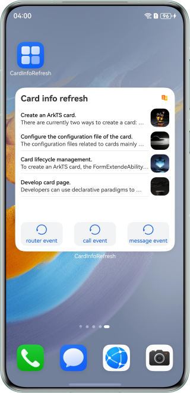
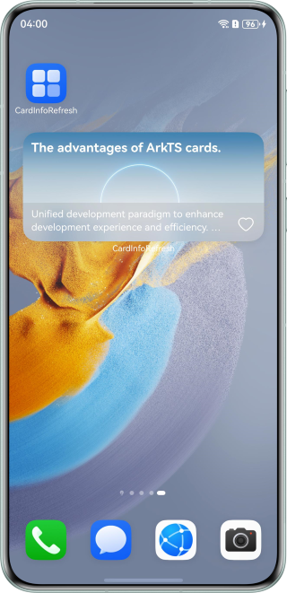

# Widget Update and Data Interaction

### Overview

Service widgets provide users with clear information, which is easy to use, intelligent, and diversified. This sample uses Form Kit to describe how to create, interact with, update, and manage widgets, helping you efficiently develop personalized service widgets.

### Preview
| Widget 1                            | Widget 2                                   |
|-------------------------------------|--------------------------------------------|
|  |  |


### How to Use

**Widget 1**
1. Install the sample app, and touch and hold the app icon to add a widget.
2. Touch the router event button to go to the app page. When you return to the home screen, you can see that the widget information is updated.
3. Touch the call event. The widget information is updated.
4. Touch the message event. The widget information is updated.
5. Set the **scheduledUpdateTime** field in the **src/main/resources/base/profile/form_config.json** file to a time point. The widget information is updated at the specified time point.

**Widget 2**
1. Install the sample app, and touch the heart-shaped icon in the upper right corner after the image and text list is displayed on the app home screen.
2. Touch and hold the app image to create widget 2, and touch the widget to start the app.
3. Select the same data entry in the app for widget display, and touch the heart-shaped icon to return to the home screen. The heart-shaped status is updated to the widget.
4. Configure the **updateDuration** field in the **src/main/resources/base/profile/form_config.json** file. The interval for updating the widget is 30 minutes. If **1** is set in the sample, the widget is updated every 30 minutes.

### Project Directory

```
├──entry/src/main/ets                     // Code area
│  ├──common
│  │  ├──utils
│  │  │  ├──Logger.ets                    // Logger
│  │  │  └──PreferencesUtil.ets           // Preference utility
│  │  ├──CommonConstants.ets              // Widget data
│  │  └──CommonData.ets                   // Widget data utilities
│  ├──entryability
│  │  └──EntryAbility.ets                 // Entry ability
│  ├──entrybackupability
│  │  └──EntryBackupAbility.ets
│  ├──entryformability
│  │  └──EntryFormAbility.ets             // Widget lifecycle
│  ├──pages
│  │  └──Index.ets                        // Home page
│  └──widget
│     ├──pages
│     │  ├──WidgetCard.ets                // Page of widget 1
│     │  └──WidgetCardUpdate.ets          // Page of widget 2
│     ├──view
│     │  └──CardListComponent.ets
│     └──viewmodel
│        └──CardListParameter.ets
└──entry/src/main/resources               // Static resources of the app
```

### How to Implement

1. The router event calls the **updateForm** method of **formProvider** in the lifecycle callback of the EntryAbility to update the widget information.
2. The call event updates the widget information in the **onAddForm** method of the EntryFormAbility and triggers the **onFormTimeChange** method of the widget UI. The **updateCardInfo** information carried in the **postCardAction** method is used to trigger the callee listening in the EntryAbility, thereby updating the widget information in the listening method.
3. The message event updates the widget information in the **onFormEvent** callback of the EntryFormAbility.
4. After widget 2 is created, the call event transfers the widget ID to EntryAbility and save the widget ID to the preferences. The app obtains the widget ID from the preferences and uses the **updateForm** method to update the specified widget.

#### Notes:
1. The widget information in this project uses the data configured in the code. In practice, you can encapsulate a method to obtain the information.

### Permissions

**ohos.permission.KEEP_BACKGROUND_RUNNING**: allows a service ability to keep running in the background. The provider app must have the permission to run the call event in the background.

### Constraints

1. The sample is only supported on Huawei phones with standard systems.
2. The HarmonyOS version must be HarmonyOS 5.0.0 Release or later.
3. The DevEco Studio version must be DevEco Studio 5.0.0 Release or later.
4. The HarmonyOS SDK version must be HarmonyOS 5.0.0 Release SDK or later.