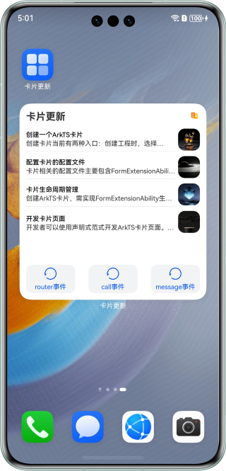

# 实现卡片更新与数据交互功能

### 介绍

服务卡片给用户提供一目了然的信息内容，具有易用可见、智能可选和多段可变的特点。本示例通过卡片开发服务（Form Kit），介绍卡片的创建、交互、更新与管理等功能的实现，使开发者能够高效完成个性化服务卡片的开发。

### 效果预览
| 卡片一                           | 卡片二                                   |
|----------------------------------|-----------------------------------------|
|  |  |


### 使用说明

**卡片一**
1. 安装应用后，长按应用图标，添加服务卡片。
2. 点击“router事件”按钮进入应用页面，返回桌面时可见卡片信息刷新。
3. 点击“call事件”，可见卡片信息刷新。
4. 点击“message事件”可见卡片信息刷新。
5. 配置“src/main/resources/base/profile/form_config.json”文件中的“scheduledUpdateTime”字段为某个时间，卡片信息即可在相应时间刷新。

**卡片二**
1. 安装应用后，应用首页展示图文列表，右上角心形支持点击。
2. 长按应用图片选择创建卡片二，点击卡片拉起应用。
3. 应用内选择卡片展示的同一条数据，点击心形按钮，返回桌面，心形状态更新至卡片。
4. 配置“src/main/resources/base/profile/form_config.json”文件中的“updateDuration”字段。卡片定时刷新的更新周期单位为30分钟。示例配置为1，表示卡片任意更新后，30分钟后定时刷新。

### 工程目录

```
├──entry/src/main/ets                     // 代码区
│  ├──common
│  │  ├──utils
│  │  │  ├──Logger.ets                    // 日志工具类
│  │  │  └──PreferencesUtil.ets           // 首选项工具类
│  │  ├──CommonConstants.ets              // 卡片数据
│  │  └──CommonData.ets                   // 卡片数据工具类
│  ├──entryability
│  │  └──EntryAbility.ets                 // 程序入口类
│  ├──entrybackupability
│  │  └──EntryBackupAbility.ets
│  ├──entryformability
│  │  └──EntryFormAbility.ets             // 卡片生命周期类
│  ├──pages
│  │  └──Index.ets                        // 首页
│  └──widget
│     ├──pages
│     │  ├──WidgetCard.ets                // 卡片一页面
│     │  └──WidgetCardUpdate.ets          // 卡片二页面
│     ├──view
│     │  └──CardListComponent.ets
│     └──viewmodel
│        └──CardListParameter.ets
└──entry/src/main/resources               // 应用静态资源目录
```

### 实现说明

1. router事件通过应用EntryAbility的生命周期回调触发更新方法，使用formProvider的updateForm方法，将内容更新到指定卡片。
2. call事件在EntryFormAbility的onAddForm中更新卡片信息，触发卡片UI的onFormTimeChange方法，通过其中postCardAction方法携带的updateCardInfo信息，触发EntryAbility中的callee监听，在监听方法中进行刷新处理。
3. message事件在EntryFormAbility的onFormEvent回调中进行刷新处理。
4. 卡片二创建后使用call事件将卡片id传递至EntryAbility后保存至首选项，应用侧从首选项获取卡片id使用updateForm方法更新指定卡片。

#### 注：
1. 本项目的卡片中信息为代码中配置的数据，在真实场景中，可以自行封装获取信息的方法。

### 相关权限

ohos.permission.KEEP_BACKGROUND_RUNNING：允许Service Ability在后台持续运行。call事件需要提供方应用具备后台运行权限。

### 约束与限制

1. 本示例仅支持标准系统上运行，支持设备：华为手机。
2. HarmonyOS系统：HarmonyOS 5.0.0 Release及以上。
3. DevEco Studio版本：DevEco Studio 5.0.0 Release及以上。
4. HarmonyOS SDK版本：HarmonyOS 5.0.0 Release SDK及以上。# a
